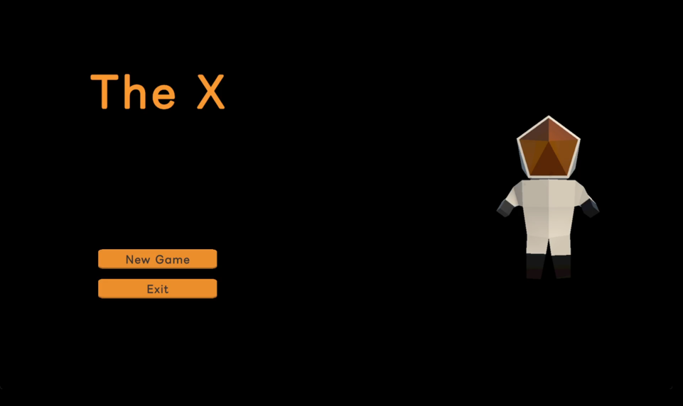
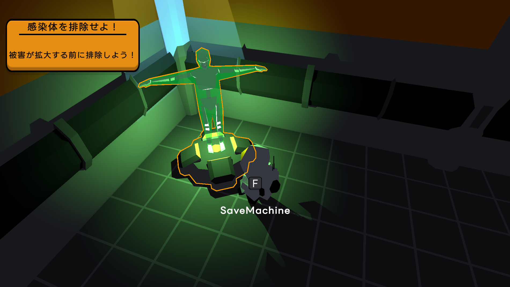

# TheX


# **プロジェクト概要**

| **項目** | **内容** |
| --- | --- |
| **プロジェクト名** | The X |
| **ジャンル** | 推理アクション |
| **開発人数 / 期間** | 1名（個人開発） / 約4ヶ月 |
| **プラットフォーム** | Windows |
| **開発環境** | Unity 6.2 / Visual Studio 2022 |
| **外部ライブラリ** | [Newton.Json](https://www.newtonsoft.com/json)/ [Outline](https://assetstore.unity.com/packages/tools/particles-effects/quick-outline-115488?locale=ja-JP&srsltid=AfmBOooy1nM8O84KYmNfC5__q4EpRDCVYMEIU9VhhUcYy6WKXKzzdYEF) |
| **ゲームの目的** | クルーに寄生した謎の生命体「X」を特定し排除する |

[プロジェクトの実行ファイル](https://github.com/Rorna/TheX_Scripts/releases/tag/v1.0.0)

[プロジェクトプレイ映像](https://www.youtube.com/watch?v=tGaO-OhM0j0)

# **操作方法**

| 行動 | キー |
| --- | --- |
| **移動** | W、A、S、D または方向キー |
| **ジャンプ** | Space Bar |
| **ダッシュ** | Shiftキーを押しながら移動 |
| **相互作用（インタラクト）** | F |
| **会話の進行** | F または 左クリック |
| **観察モード** | 観察UIがアクティブな状態で Tabキー |
| **審判** | 観察UIがアクティブな状態で Jキー |
| **射撃** | 戦闘状態で左クリック |
| **リロード** | 戦闘状態で Rキー |


# **開発哲学**

常に「この機能がこのクラスに属するのが適切か」「この呼び出し構造は正しいか」について絶えず考察してきました。過去に一つのクリスで複数の機能が混在する「ゴッドクラス」や結合度の高いスパゲティコードを経験し、苦労した経験がありました。本プロジェクトでは、**単一責任の原則（SRP）を意識し、クラス間の結合度を下げて保守性の高いコードの作成に集中しました。**

# **プロジェクト構造**

コードの保守性と拡張性を高めるため、クラス間の直接参照を最小限に抑えるFacadeパターンの導入とManager-Controller構造を実装しました。また、柔軟な制御を実現するためにインターフェースベースの設計を積極的に活用しています。


## **Facade パターン**

外部からのすべての機能リクエストは、単一の窓口であるFacadeクラスを経由するように設計し、システムの複雑さを軽減しました。

Facadeは処理に最も適したManagerに作業を委譲することで、クラス間の依存関係を軽減しました。


> **関連コード**: [`Facade`](https://github.com/Rorna/TheX_Scripts/blob/107242b0cc4a5f424de204d399375bf91f01f51e/Scripts/System/Facade.cs#L54-L57), [`GameSceneManager`](https://github.com/Rorna/TheX_Scripts/blob/107242b0cc4a5f424de204d399375bf91f01f51e/Scripts/Managers/GameSceneManager.cs#L69-L75), [`GameSceneController`](https://github.com/Rorna/TheX_Scripts/blob/107242b0cc4a5f424de204d399375bf91f01f51e/Scripts/Controllers/GameSceneController.cs#L20-L23)など
> 

*クラス名や名前をクリックすると詳細を確認できます。*

## **Manager - Controller 構造**

役割の明確な分離のため、Managerはデータ管理と命令のみを、Controllerは実質的なロジックの実行を担当するように設計しました。


ManagerとControllerは機能ごとに実装しました。

> **関連コード**: [`ActionManager`](https://github.com/Rorna/TheX_Scripts/blob/main/Scripts/Managers/ActionManager.cs), [`ActionController`](https://github.com/Rorna/TheX_Scripts/blob/main/Scripts/Controllers/ActionController.cs) など
> 

*クラス名や名前をクリックすると詳細を確認できます。*

## **インターフェース制御**

クラスを直接参照する代わりに、インターフェースを通じて制御を行うよう設計しました。これにより、内部ロジックやUIの詳細な実装が変更されても、制御側のコードを修正する必要がない、柔軟で拡張性の高い構造を構築しました。


> **関連コード**: [`DialogController`](https://github.com/Rorna/TheX_Scripts/blob/107242b0cc4a5f424de204d399375bf91f01f51e/Scripts/Controllers/UI/DialogController.cs#L152-L180), [`IDialog`](https://github.com/Rorna/TheX_Scripts/blob/main/Scripts/UI/Interface/IDialog.cs), [`UIDialog`](https://github.com/Rorna/TheX_Scripts/blob/107242b0cc4a5f424de204d399375bf91f01f51e/Scripts/UI/UIDialog.cs#L149-L159)
> 

*クラス名や名前をクリックすると詳細を確認できます。*

# **主な実装機能**

## **Data-Driven System**

ハードコーディングを徹底的に排除し、企画の変更に柔軟に対応できるよう、クエスト、ダイアログ、スキルなどのコアデータを分離しました。


### **実装詳細**

データをJSON形式で定義し、パースして動的にロードする仕組みを構築しました。コードを修正することなく、JSONデータの編集のみで新規コンテンツの追加やバランス調整が可能となり、開発効率を大きく向上させました。

``` json
{
    "id": "Q_KillTheX",
    "questType": "Target",
    "title": "感染体を排除せよ！",
    "description": "被害が拡大する前に排除しよう！",
    "targetID": "Astronaut_Alien_Enemy",
    "completeAction":
    {
    "actionType": "RunDialog",
    "targetID": "CompleteKillQuest"
    }
}
```
> QuestInfo.json




> **関連リソース**: [`QuestInfo.json`](https://github.com/Rorna/TheX_Scripts/blob/107242b0cc4a5f424de204d399375bf91f01f51e/Jsons/JPN/Quest/QuestInfo.json#L31-L42), [`JsonClass`](https://github.com/Rorna/TheX_Scripts/blob/107242b0cc4a5f424de204d399375bf91f01f51e/Scripts/System/JsonClass.cs#L82-L108), [`QuestManager`](https://github.com/Rorna/TheX_Scripts/blob/107242b0cc4a5f424de204d399375bf91f01f51e/Scripts/Managers/QuestManager.cs#L65-L75), [`QuestController`](https://github.com/Rorna/TheX_Scripts/blob/107242b0cc4a5f424de204d399375bf91f01f51e/Scripts/Controllers/QuestController.cs#L15-L20), [`ClueQuest`](https://github.com/Rorna/TheX_Scripts/blob/107242b0cc4a5f424de204d399375bf91f01f51e/Scripts/Quest/ClueQuest.cs#L19-L35)
> 

*クラス名や名前をクリックすると詳細を確認できます。*

## **エネミーAI (FSM & インターフェースベースのスキルシステム)**

**エネミー**の行動パターンを体系的に管理し、拡張性を確保するため、FSMとインターフェースベースのスキルシステムを構築しました。

### **FSM管理**

`EnemyBrain`クラスが全体的な判断を担当し、Move、Attackなどの各状態を独立したクラスに分離して管理の容易性を高めました。

> **関連コード:** [`EnemyFSM`](https://github.com/Rorna/TheX_Scripts/blob/107242b0cc4a5f424de204d399375bf91f01f51e/Scripts/FSM/Enemy/EnemyFSM.cs#L12-L24), [`EnemyBrain`](https://github.com/Rorna/TheX_Scripts/blob/107242b0cc4a5f424de204d399375bf91f01f51e/Scripts/System/EnemyBrain.cs#L66-L89), [`EnemyController`](https://github.com/Rorna/TheX_Scripts/blob/main/Scripts/Controllers/EnemyController.cs)
> 

*クラス名や名前をクリックすると詳細を確認できます。*

### **インターフェースによるスキル制御**

`ISkill`インターフェースを通じて、様々な攻撃パターン（Rush, Shockwaveなど）を共通の方法で制御できるようにし、既存のコードを修正することなく新しいスキルを追加できる構造を構築しました。


> **関連**コード: [`EnemyBrain`](https://github.com/Rorna/TheX_Scripts/blob/107242b0cc4a5f424de204d399375bf91f01f51e/Scripts/System/EnemyBrain.cs#L91-L105), [`ISkill`](https://github.com/Rorna/TheX_Scripts/blob/main/Scripts/Skill/Interface/ISkill.cs), [`EnemySkillHandler`](https://github.com/Rorna/TheX_Scripts/blob/107242b0cc4a5f424de204d399375bf91f01f51e/Scripts/Skill/EnemySkillHandler.cs#L78-L94)
> 

*クラス名や名前をクリックすると詳細を確認できます。*

### **エネミーの行動ロジック**

JSONで設定された基準距離に基づき、プレイヤーとの距離を保ちながらランダムに行動するロジックを実装し、動きの単調さを減らしました。

#### Move

敵の移動を担当します。プレイヤーと敵の距離を基準距離と比較し、ランダムな時間、ランダムな距離をランダムな方向へ移動するようにしました。基準距離より近ければプレイヤーから遠ざかり、遠ければプレイヤーに近づくよう実装しました。

> **関連リソース**: [`EnemyMoveState`](https://github.com/Rorna/TheX_Scripts/blob/107242b0cc4a5f424de204d399375bf91f01f51e/Scripts/FSM/Enemy/State/EnemyMoveState.cs#L26-L66) , [`EnemyInfo.json`](https://github.com/Rorna/TheX_Scripts/blob/main/Jsons/Common/Object/EnemyInfo.json#L30)
> 

*クラス名や名前をクリックすると詳細を確認できます。*

##### 遠ざかる
https://github.com/user-attachments/assets/c3cd9b61-2922-41d6-8205-f8d9be1276cc


##### 近づく
https://github.com/user-attachments/assets/d79586e9-b6d6-4d22-b9ca-93aff3af13fe


#### Attack

- **RushAttack (突進攻撃)**
    プレイヤーの方向へ素早く突進するようにロジックを実装しました。
  
    https://github.com/user-attachments/assets/4d004334-6f70-4616-9789-c73597eb5797


    > **関連リソース**: [`RushAttack`](https://github.com/Rorna/TheX_Scripts/blob/107242b0cc4a5f424de204d399375bf91f01f51e/Scripts/Skill/Skills/RushAttack.cs#L62-L79) , [`SkillInfo.json`](https://github.com/Rorna/TheX_Scripts/blob/107242b0cc4a5f424de204d399375bf91f01f51e/Jsons/Common/Skill/SkillInfo.json#L4-L12)
    > 
    
    *クラス名や名前をクリックすると詳細を確認できます。*
    
    
- **ShockWaveAttack (衝撃波攻撃)**
    
    パーティクルシステムを活用して、衝撃波の演出および当たり判定を実装しました。
  
    https://github.com/user-attachments/assets/f61409ee-1f1c-42ce-a488-dc9ad50ecfbb

    > **関連リソース**: [`ShockWaveAttack`](https://github.com/Rorna/TheX_Scripts/blob/107242b0cc4a5f424de204d399375bf91f01f51e/Scripts/Skill/Skills/ShockWaveAttack.cs#L64-L86), [`SkillInfo.json`](https://github.com/Rorna/TheX_Scripts/blob/107242b0cc4a5f424de204d399375bf91f01f51e/Jsons/Common/Skill/SkillInfo.json#L13-L24)
    > 
    
    *クラス名や名前をクリックすると詳細を確認できます。*
    
    

## **観察と審判のギミック設計**

### **実装内容**

観察と審判、それぞれのControllerが自身の役割にのみ集中できるように分離して設計しました。クラス間の直接参照の代わりにFacadeパターンを活用して通信を行うよう実装しました。

#### 観察
https://github.com/user-attachments/assets/42466158-bea2-4196-9fa1-5117d0a4a294


#### 審判を執行する
https://github.com/user-attachments/assets/c4d75660-03fc-469f-9c32-b5a21cab8cfd


> **関連コード**:  [`ObservationManager`](https://github.com/Rorna/TheX_Scripts/blob/107242b0cc4a5f424de204d399375bf91f01f51e/Scripts/Managers/ObservationManager.cs#L60-L73), [`ObservationController`](https://github.com/Rorna/TheX_Scripts/blob/107242b0cc4a5f424de204d399375bf91f01f51e/Scripts/Controllers/ObservationController.cs#L64-L87), [`JudgementController`](https://github.com/Rorna/TheX_Scripts/blob/107242b0cc4a5f424de204d399375bf91f01f51e/Scripts/Controllers/JudgementController.cs#L61-L93)
> 

*クラス名や名前をクリックすると詳細を確認できます。*

# **参考文献およびリファレンス**

- [Level up your code with Game Programming Patterns](https://unity.com/ja/resources/level-up-your-code-with-game-programming-patterns)
- [Newtonsoft.Json](https://www.newtonsoft.com/json)
- [Quick Outline](https://assetstore.unity.com/packages/tools/particles-effects/quick-outline-115488?locale=ja-JP&srsltid=AfmBOooy1nM8O84KYmNfC5__q4EpRDCVYMEIU9VhhUcYy6WKXKzzdYEF)
